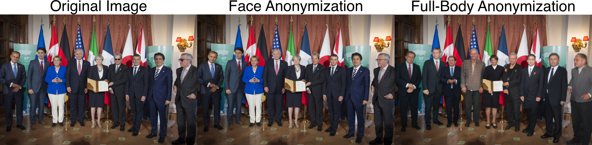

<center>

# DeepPrivacy2 - A Toolbox for Realistic Image Anonymization
[[Paper]](https://openaccess.thecvf.com/content/WACV2023/papers/Hukkelas_DeepPrivacy2_Towards_Realistic_Full-Body_Anonymization_WACV_2023_paper.pdf) [[Appendix]](https://openaccess.thecvf.com/content/WACV2023/supplemental/Hukkelas_DeepPrivacy2_Towards_Realistic_WACV_2023_supplemental.pdf) [](https://huggingface.co/spaces/haakohu/deep_privacy2)
[[Video Demo]](https://youtu.be/Kt3au719hhk)
[[Conference Presentation]](https://youtu.be/wwKRkkzxKuM)
[[Documentation]](http://hukkelas.no/deep_privacy2/)

</center>

DeepPrivacy2 is a toolbox for realistic anonymization of humans, including a face and a full-body anonymizer.




DeepPrivacy first detects, then recursively anonymization all individuals in an image with a  Generative Adversarial Network (GAN) that synthesizes one individual at a time.


## DeepPrivacy2 vs [DeepPrivacy1](https://github.com/hukkelas/DeepPrivacy)

This repository improves over the original [DeepPrivacy](https://github.com/hukkelas/DeepPrivacy) repository with the following new features:
- **Full-body anonymization:** Anonymize the entire human body with a single generator
- **Improved Face Anonymization:** Improved quality and higher resolution (256x256 vs. 128x128) face anonymization without relying on facial landmark detection.
- **Attribute Guided Anonymiation:** Anonymize faces guided on text prompts using [StyleMC](https://github.com/catlab-team/stylemc).
- **Code cleanup and general improvements:** Extensive refactoring, bugfixes, and improvements yielding improved results and faster training.

## Useful Links

- [Installation instructions](https://www.hukkelas.no/deep_privacy2/#/README).
- [Anonymization Instructions](https://www.hukkelas.no/deep_privacy2/#/anonymization).
- [Training Instructions](https://www.hukkelas.no/deep_privacy2/#/training_and_development).

## Quick Start

### Installation
We recommend to setup and install pytorch with [anaconda](https://www.anaconda.com/) following the [pytorch installation instructions](https://pytorch.org/get-started/locally/).

1. Clone repository: `git clone https://github.com/hukkelas/deep_privacy2/`.
2. Install using `setup.py`:
```
pip install -e .
```
or:
```
pip install git+https://github.com/hukkelas/deep_privacy2/
```

See the [documentation](https://www.hukkelas.no/deep_privacy2/#/) for more installation instructions.

### Anonymization
[anonymize.py](anonymize.py) is the main script for anonymization.

**Full-Body Anonymization**
```
python3 anonymize.py configs/anonymizers/FB_cse.py -i media/regjeringen.jpg --output_path output.png --visualize
```
**Face Anonymization**
```
python3 anonymize.py configs/anonymizers/face.py -i media/regjeringen.jpg --output_path output.png --visualize
```
**Webcam anonymization**
```
python3 anonymize.py configs/anonymizers/FB_cse.py --webcam
```


See the [documentation](https://www.hukkelas.no/deep_privacy2/#/anonymization) for more detailed instructions for anonymization.

### Gradio Demos
The repository includes gradio demos to show of the capabilities of DeepPrivacy2.

**Face anonymization**. Test it on [Hugginface](https://huggingface.co/spaces/haakohu/deep_privacy2_face).
```
python3 -m gradio_demos.face
```

**Full-body anonymization**. Test it on [Hugginface](https://huggingface.co/spaces/haakohu/deep_privacy2).
```
python3 -m gradio_demos.body_cse
```


## License
This repsitory is released under [Apache 2.0 License](License), except for the following:.

- Code under `sg3_torch_utils/`. This code is modified from [github.com/NVlabs/stylegan2-ada-pytorch](https://github.com/NVlabs/stylegan2-ada-pytorch). Separate license is attached in the directory.
- Detection network: See [Detectron2 License](https://github.com/facebookresearch/detectron2/blob/main/LICENSE).
- All checkpoints follow the license of the datasets. See the respective datasets for more information.
- Code under `dp2/detection/models/vit_pose`. This code is modified from [https://github.com/gpastal24/ViTPose-Pytorch](https://github.com/gpastal24/ViTPose-Pytorch), where code is adapted from OpenMMLab. Original license is [Apache 2-0](https://github.com/open-mmlab/mmpose/blob/master/LICENSE).
