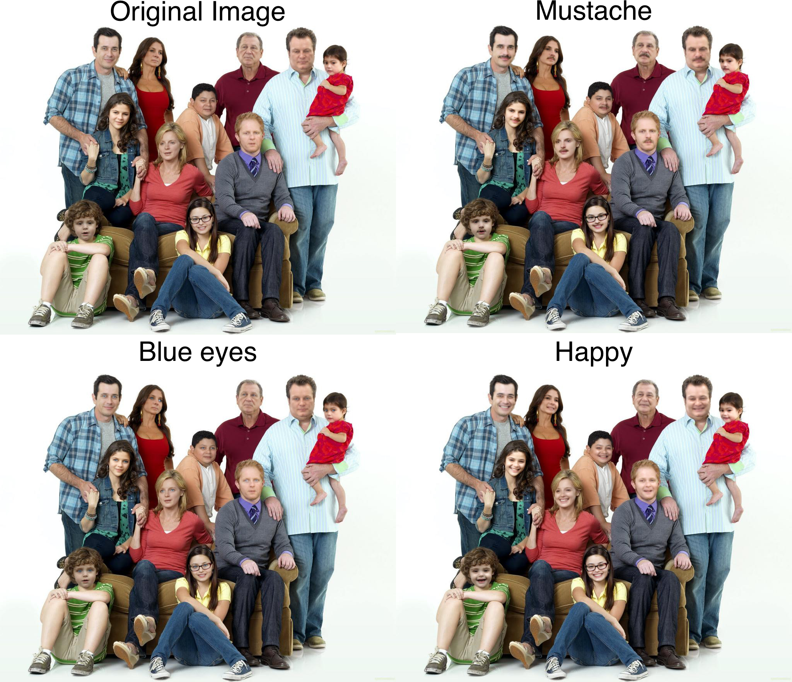

# DeepPrivacy2 - A Toolbox for Realistic Image Anonymization
[[PDF]](http://arxiv.org/abs/2211.09454) [](https://huggingface.co/spaces/haakohu/deep_privacy2)
[[Video Demo]](https://youtu.be/Kt3au719hhk)
[[WACV 2023 Presentation]](https://youtu.be/wwKRkkzxKuM)


DeepPrivacy2 is a toolbox for realistic anonymization of humans, including a face and a full-body anonymizer.


DeepPrivacy2 detects and anonymizes individuals via three detection and synthesis networks; (1) a CSE-guided generator for individuals detected with dense pose (by CSE), (2) an unconditional full-body generator for cases where CSE fails to detect (note the segmented persons without color-coded CSE detections), and (3) a face generator for the remaining individuals (marked in red).


## What's new

This repository improves over the original [DeepPrivacy](https://github.com/hukkelas/DeepPrivacy) repository with the following new features:
- **Full-body anonymization:** Anonymize the entire human body with a single generator
- **Improved Face Anonymization:** Improved quality and higher resolution (256x256 vs. 128x128) face anonymization without relying on facial landmark detection.
- **Attribute Guided Anonymiation:** Anonymize faces guided on text prompts using [StyleMC](https://github.com/catlab-team/stylemc).
- **Code cleanup and general improvements:** Extensive refactoring, bugfixes, and improvements yielding improved results and faster training.

## Installation
### Requirements
- Pytorch >= 1.10
- Torchvision >= 0.12
- Python >= 3.8
- CUDA capable device for training. Training was done with 1-8 32GB V100 GPUs.


### Installation
We recommend to setup and install pytorch with [anaconda](https://www.anaconda.com/) following the [pytorch installation instructions](https://pytorch.org/get-started/locally/).

1. Clone repository: `git clone https://github.com/hukkelas/deep_privacy2/`.
2. Install using `setup.py`:
```
pip install -e .
```
or:
```
pip install git+https://github.com/hukkelas/deep_privacy2/
```

### Installation with Docker

1. Install [nvidia-docker](https://github.com/NVIDIA/nvidia-docker) to support GPU acceleration.
2. Build the docker image using the [Dockerfile](Dockerfile).
```bash
# If you're not planning to train the network (or not use wandb logging), you can remove the WANDB_API_KEY argument.
docker build -t deep_privacy2 --build-arg WANDB_API_KEY=YOUR_WANDB_KEY  --build-arg UID=$(id -u) --build-arg UNAME=$(id -un) .
```
3. Run the docker image with selected command:
```
docker run --runtime=nvidia --gpus '"device=0"' --name deep_privacy2 --ipc=host -u $(id -u) -v $PWD:/workspace  -v /mnt/work2:/mnt/work2 -it deep_privacy2
```


## Anonymization
[anonymize.py](anonymize.py) is the main script for anonymization.

The typical usage is
```
python3 anonymize.py configs/anonymizers/FB_cse.py -i path_to_image.png
```
where the first argument is the chosen anonymizer (see below for the different models) and the second a path to an image/folder/video.

There are several optional arguments, see `python3 anonymize.py --help` for more info.
```
python3 anonymize.py -h
Usage: anonymize.py [OPTIONS] CONFIG_PATH

  config_path: Specify the path to the anonymization model to use.

Options:
  -i, --input_path PATH           Input path. Accepted inputs: images, videos,
                                  directories.
  -o, --output_path PATH          Output path to save. Can be directory or
                                  file.
  --visualize                     Visualize the result
  --max_res INTEGER               Maximum resolution  of height/wideo
  --start-time, --st INTEGER      Start time (second) for vide anonymization
  --end-time, --et INTEGER        End time (second) for vide anonymization
  --fps INTEGER                   FPS for anonymization
  --detection-score-threshold FLOAT RANGE
                                  Detection threshold, threshold applied for
                                  all detection models.  [0<=x<=1]
  --visualize-detection           Visualize only detections without running
                                  anonymization.
  --multi-modal-truncation, --mt  Enable multi-modal truncation proposed by:
                                  https://arxiv.org/pdf/2202.12211.pdf
  --no-cache                      Disable loading of detection cache. Will
                                  rerun all detections.
  --amp                           Use automatic mixed precision for generator
                                  forward pass
  -t, --truncation_value FLOAT RANGE
                                  Latent interpolation truncation value.
                                  [0<=x<=1]
  --track                         Track detections over frames. Will use the
                                  same latent variable (z) for tracked
                                  identities.
  --seed INTEGER                  Set random seed for generating images.
  --person-generator PATH         Config path to unconditional person
                                  generator
  --cse-person-generator PATH     Config path to CSE-guided person generator
  --webcam                        Read image from webcam feed.
  --help                          Show this message and exit.

```

**Singe image anonymization**
```
python3 anonymize.py configs/anonymizers/FB_cse.py -i path_to_image.png --output_path output.png
```

**Folder anonymization**

If a folder is given as the input, all image and video files in the given folder will be anonymized and placed under --output_path. The script will duplicate the directory structure/filenames in the given folder for the output.
```
python3 anonymize.py configs/anonymizers/FB_cse.py -i path/to/input/folder --output_path output_folder
```

**Video anonymization**
```
python3 anonymize.py configs/anonymizers/FB_cse.py -i path_to_video.mp4 --output_path output.mp4
```

**Webcam anonymization**
```
python3 anonymize.py configs/anonymizers/FB_cse.py --webcam
```

### Available anonymization models
DeepPrivacy2 provides the following anonymization models:

- [`configs/anonymizers/FB_cse.py`](configs/anonymizers/FB_cse.py): Full-body anonymizer that only anonymizes individuals detected by CSE. This provides the highest quality anonymization, however, some individuals might not be detected by CSE.
- [`configs/anonymizers/FB_cse_mask.py`](configs/anonymizers/FB_cse_mask.py): Full-body anonymizer that anonymizes all individuals detected by CSE or Mask R-CNN. In difference from `configs/anonymizers/FB_cse.py`, this model anonymizes individuals not detected by CSE with an unguided generator.
- [`configs/anonymizers/FB_cse_mask_face.py`](configs/anonymizers/FB_cse_mask_face.py): Full-body and face anonymizer that anonymizes all individuals detected by CSE, Mask R-CNN or by face detection. Compared to `configs/anonymizers/FB_cse_mask.py`, this model anonymizes individuals not detected by CSE or Mask R-CNN with a face anonymizer.
- [`configs/anonymizers/face.py`](configs/anonymizers/face.py): The face anonymizer only anonymizes a center crop of the face.
- [`configs/anonymizers/face_fdf128.py`](configs/anonymizers/face_fdf128.py): Same as [`configs/anonymizers/face.py`](configs/anonymizers/face.py), but the generator is trained on lower resolution images (128x128 or lower). Recommended to use if you will not anonymize any faces larger than 128x128. **Model will be released soon.**

## Attribute guided anonymization
DeepPrivacy2 allows for controllable anonymization through text prompts by adapting [StyleMC](https://github.com/catlab-team/stylemc).
StyleMC finds global semantically meaningful directions in the GAN latent space by manipulating images towards a given text prompt with a [CLIP](https://github.com/openai/CLIP)-based loss.


The repository includes a  demo for interactive text-guided anonymization.
To use the demo, first:

1. Download the FDF256 dataset (see below). Only the validation set is required.
2. Run the following:
```
python3 attribute_guided_demo.py
```

The script will spin up a local webserver.


## Training
First, download dataset for training (see below).

To start training, type the following:
```
python3 train.py configs/fdh/styleganL.py
```
The training automatically logs to [wandb](https://wandb.ai/).

### Model development utility scripts
**Dataset inspection:** To inspect the training dataset, you can use:
```
python3 -m tools.inspect_dataset configs/fdh/styleganL.py
```

**Sanity check:** 
```
python3 -m tools.dryrun configs/fdh/styleganL.py
```

**Output visualization:** To visualize output of trained models:
```
python3 -m tools.show_examples configs/fdh/styleganL.py
```


#### Calculating metrics
```
python3 validate.py configs/fdh/styleganL.py
```
**NOTE:** The metrics calculated with validate.py will slightly differ from training metrics, as validate.py disables automatic mixed precision.


## Dataset Setup

**Setting Data directory:** 
The default dataset directory is ./data. If you want to change the dataset directory, set the environment variable `BASE_DATASET_DIR`. For example, `export BASE_DATASET_DIR=/work/data/`.


### FDF256
Follow the instructions [here](https://github.com/hukkelas/FDF/blob/master/FDF256.md) to download the FDF256 dataset. The dataset should be placed in the directory: `data/fdf256`.

### FDH
Follow the instructions [here](https://www.github.com/hukkelas/FDH) to download the FDH dataset. The dataset should be placed in the directory: `data/fdh`.


## License
This repsitory is released under [Apache 2.0 License](License), except for the following:.

- Code under `sg3_torch_utils/`. This code is modified from [github.com/NVlabs/stylegan2-ada-pytorch](https://github.com/NVlabs/stylegan2-ada-pytorch). Separate license is attached in the directory.
- Detection network: See [Detectron2 License](https://github.com/facebookresearch/detectron2/blob/main/LICENSE).
- All checkpoints follow the license of the datasets. See the respective datasets for more information.
- Code under `dp2/detection/models/vit_pose`. This code is modified from [https://github.com/gpastal24/ViTPose-Pytorch](https://github.com/gpastal24/ViTPose-Pytorch), where code is adapted from OpenMMLab. Original license is [Apache 2-0](https://github.com/open-mmlab/mmpose/blob/master/LICENSE).
